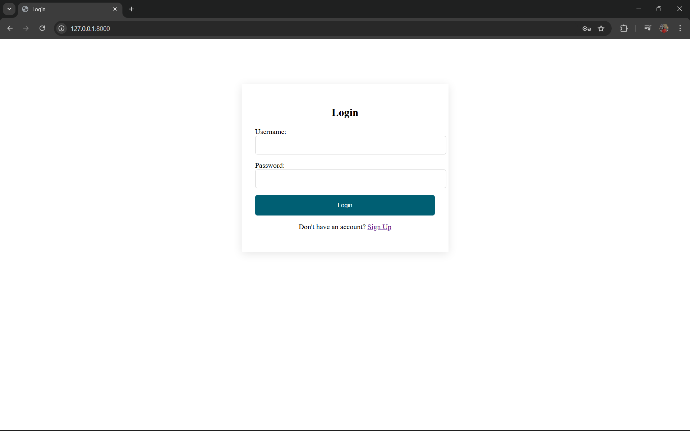
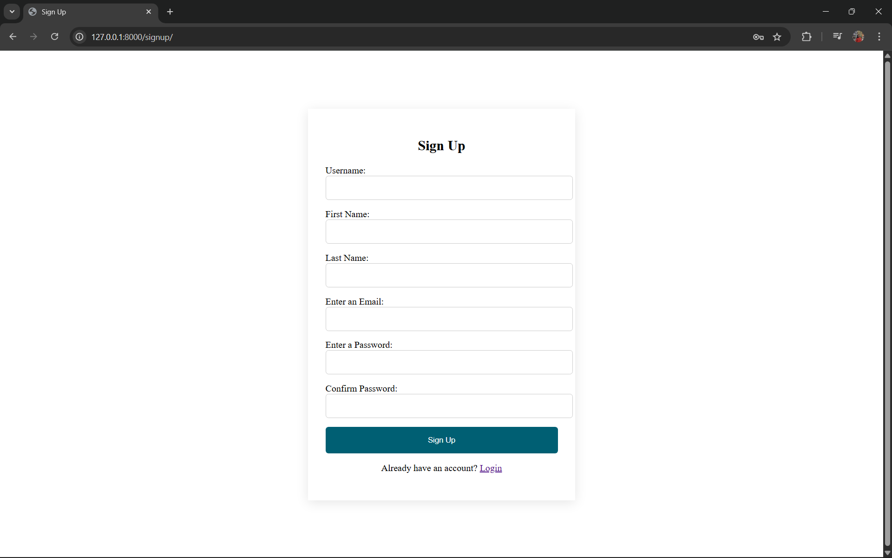
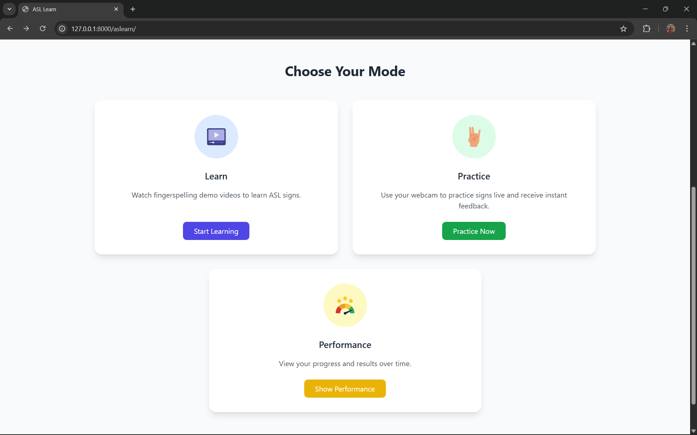
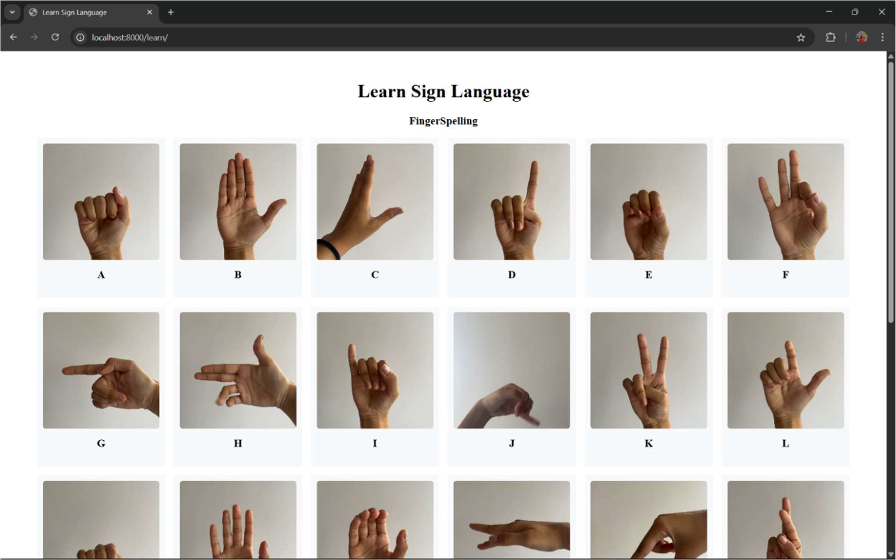
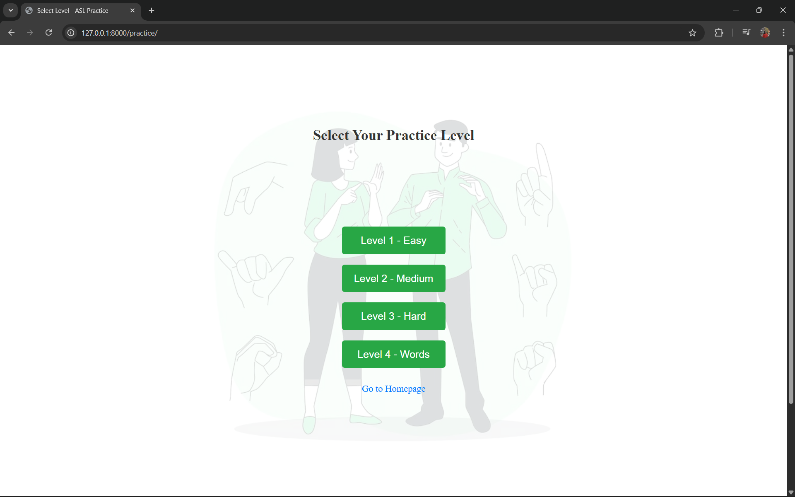
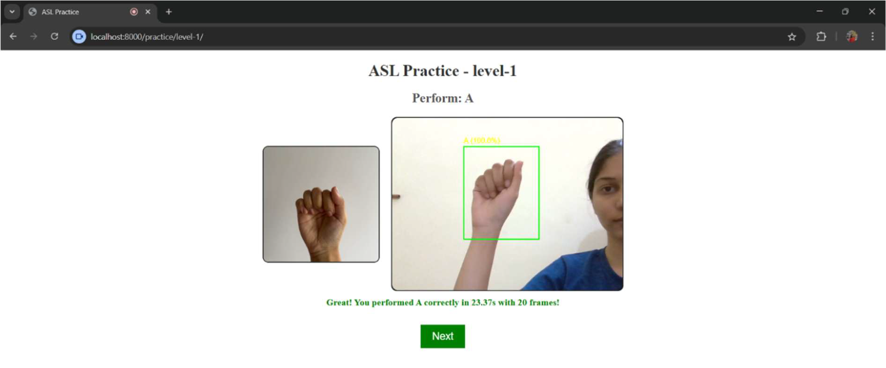
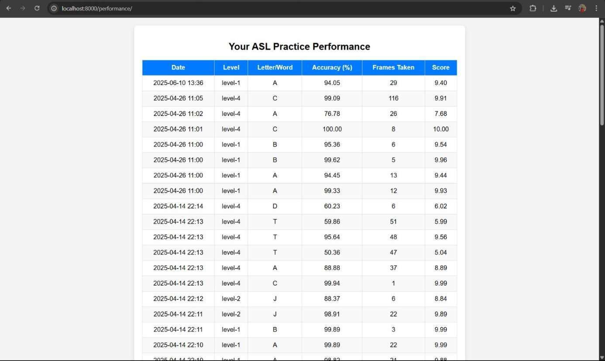

# Sign Language Learning Platform
## ASLearn – AI-Powered Sign Language Learning Platform (ASL)

ASLearn is an intelligent web-based platform designed to help users learn and practice American Sign Language (ASL) using real-time hand gesture recognition through a webcam.

The system integrates Deep Learning, MediaPipe, and Django to provide instant feedback, gamified learning levels, and performance analytics in an interactive environment.


## 📌 Project Overview

People unfamiliar with sign language often face communication barriers while interacting with hearing-impaired individuals. Existing solutions are limited by cost and accessibility.

ASLearn provides a real-time, affordable, and interactive learning platform that enables users to master ASL alphabets and words using AI-powered recognition.


## 🎯 Project Objectives

- Build an intelligent ASL recognition system using deep learning
- Enable real-time webcam-based gesture detection
- Provide visual learning through demo videos
- Introduce gamified learning levels
- Track user performance and progress
- Promote inclusivity and accessibility


## 🛠 Tools & Technologies

- Python  
- TensorFlow / Keras  
- OpenCV  
- MediaPipe  
- Django  
- SQLite  
- HTML, CSS, JavaScript  
- Google Colab  


### 🔐 Login & Authentication





- Secure login and signup system
- User session handling
- Personalized access


### 🏠 Home Dashboard




- Learn Mode
- Practice Mode
- Performance Section
- Simple navigation


### 📚 Learn Mode (A–Z Videos)



- Displays ASL videos (A–Z)
- Auto-play on hover
- Visual understanding


### 🎯 Practice Mode – Real-Time Detection





- Webcam integration
- Bounding box detection
- Accuracy display
- Instant feedback


### 📊 Performance Dashboard



- Attempt history
- Accuracy tracking
- Progress analysis


## ✨ Key Features

✔ User Authentication  
✔ Interactive Learning Interface  
✔ Real-Time Gesture Recognition  
✔ Gamified Levels  
✔ Accuracy & Score Display  
✔ Performance Tracking  
✔ Secure Database Storage  


## 🧩 System Architecture
```
Webcam → MediaPipe → CNN Model → Django Backend → UI → Database
```
## 🧠 Model Architecture

### 🔹 Base Model
- MobileNetV2 (Pre-trained on ImageNet)
- include_top = False

### 🔹 Custom Layers
- Conv2D (32 → 64 → 128)
- Batch Normalization
- Global Average Pooling
- Dense Layers
- Dropout (0.3)
- Softmax Output


## ⚙️ Training Configuration

| Parameter | Value |
|-----------|--------|
| Input Size | 224 × 224 |
| Classes | 26 (A–Z) |
| Optimizer | Adam |
| Loss | Categorical Crossentropy |
| Epochs | 100 |
| Batch Size | 32 |


## 📈 Model Performance

| Metric | Value |
|--------|--------|
| Training Accuracy | ~97% |
| Validation Accuracy | ~92–94% |
| Overall Accuracy | ~97% |
| Training Loss | ~0.11 |
| Validation Loss | ~0.20 |

The narrow gap between training and validation accuracy indicates good generalization and minimal overfitting.


## 🎮 Gamified Learning Levels

| Level | Content | Difficulty |
|-------|----------|------------|
| 1 | A, B, C, E, L, O, V, W, U, Y | Easy |
| 2 | D, F, K, R, S, I, X, M | Medium |
| 3 | G, H, P, Q, J, Z, N, T | Hard |
| 4 | CAT, DOG, SUN, MOON, TREE | Words |


## ▶️ How to Run the Project

Follow these simple steps to run the project locally:

1. Open the project folder in your system.
2. Make sure Python and Django are installed.
3. Open Command Prompt / Terminal in the project directory.
4. Run the following command:
```
python manage.py runserver
```
5. After starting the server, open your browser and go to:
```
http://127.0.0.1:8000/
```
6. Login or Sign Up to start using the platform.


## 🔮 Future Scope

- Mobile Application Development  
- Multi-language Support (ISL, BSL, etc.)  
- AI Avatar Integration  
- Subtitle-to-Sign Conversion  
- Emotion Recognition  
- Cloud Deployment
